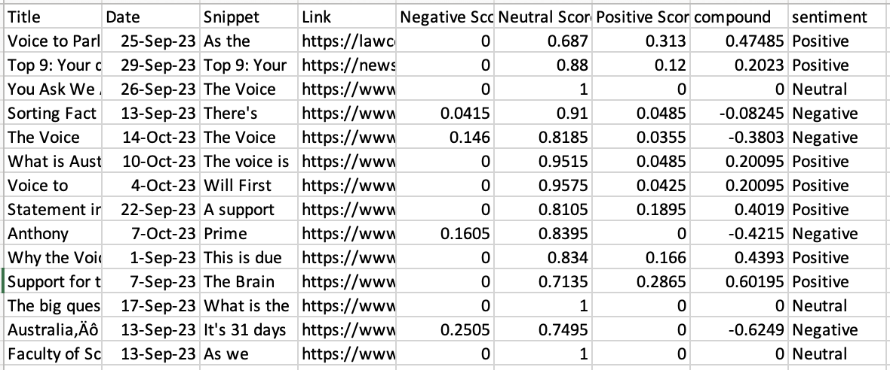

# News Scrapper and Sentiment Analysis

## Overview

The News Sentiment Analysis Dashboard is a Python program that leverages web scraping, sentiment analysis, and interactive visualization to analyze news articles related to 'Voice to Parliament' during the time period from September 1, 2023, to October 14, 2023. The program uses Beautiful Soup and Selenium for web scraping, VADER Sentiment Analysis for sentiment analysis, and Dash with Plotly for creating an interactive dashboard.

## Related Libraries Installations (if not git clone)

### pip install pandas
### pip install selenium
### pip install beautifulsoup
### pip install webdriver_manager
### pip install vaderSentiment
### pip install dash
### pip install dash-mantine-components

## Usage
1. Run the web scraping file:
    python newsScrapper.py
2. The program will generate a raw CSV file with desired news:

3. Run the sentiment analyse file:
    python sentimentAnaylse.py
4. The program will run sentimental analysis and generate a CSV file with sentimental scores:

5. Run the Dashboard:
    python dashBoard.py
6. Open a web browser and navigate to http://127.0.0.1:8050/
7. Explore the interactive DataTable and pie chart to analyse sentiment results.

This template includes specific sections for the web scraping, sentiment analysis, and usage instructions for your program. Feel free to adapt and customize it further based on your specific implementation and requirements.
